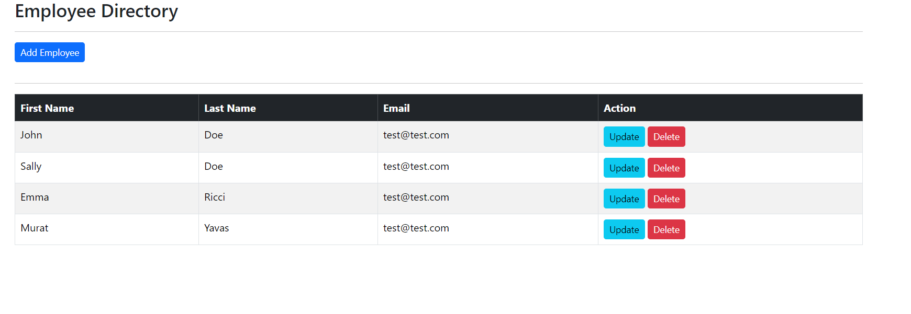
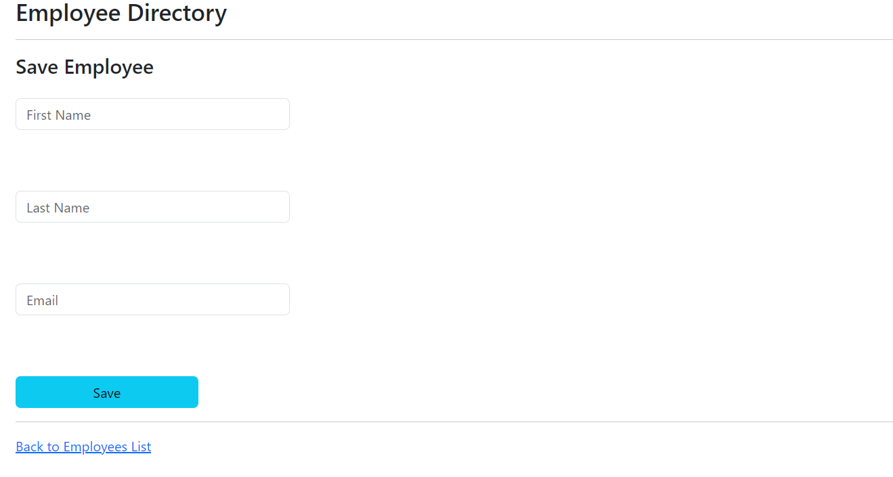

# Spring Boot CRUD App

## Simple CRM app created with Spring Boot and Thymeleaf

### Technologies
-   Spring Boot
-   Thymeleaf
-   MySQL

### Preview




### How to run

To run this project you need to set your own credentials at src/main/resources/application.properties

```
spring.datasource.url=YOUR_DB_URL
spring.datasource.username=YOUR_DB_USERNAME
spring.datasource.password=YOUR_DB_PASSWORD
```